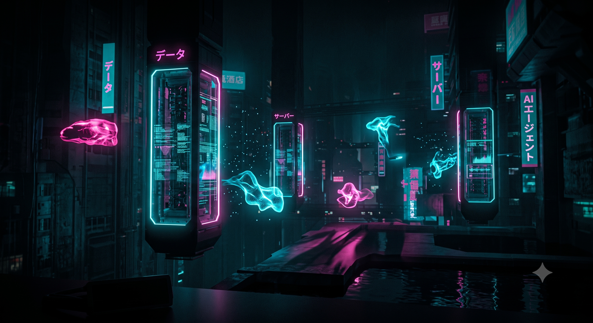

# NeonFX

A synthwave Omarchy theme — deep void purple, cyan text, magenta neon accents. Includes Ghostty GPU shaders, a custom bat syntax theme, Midnight Commander skin, and shell integration for syntax-highlighted `cat`.



## Requirements

| Requirement | Notes |
|-------------|-------|
| [Omarchy](https://omarchy.org) | Hyprland desktop stack, theme system, menu |
| Ghostty | Default Omarchy terminal; required for Neon FX shaders |
| `bat` | Syntax highlighting for `cat` (ships with Omarchy) |
| Fish or Bash | Both supported; fish colors + bat routing wired for each |

Optional: Midnight Commander, VS Code / Cursor (SynthWave '84 extension).

---

## Quick install (one command)

From a clone of this repo:

```bash
git clone https://github.com/pepijn-blom/NeonFX.git
cd NeonFX
./install
```

Or install straight from git without cloning first:

```bash
git clone https://github.com/pepijn-blom/NeonFX.git /tmp/NeonFX
/tmp/NeonFX/install
```

The installer:

1. Symlinks the theme into `~/.config/omarchy/themes/neonfx`
2. Wires Omarchy hooks (bat, MC, bash, Neon FX menu)
3. Installs CLI tools to `~/.local/bin`
4. Runs `omarchy theme set "NeonFX"`

**Open a new terminal tab** after install so fish/bash pick up `BAT_THEME` and the `cat` wrapper.

### Verify

```bash
neonfx-doctor
```

### Uninstall

```bash
neonfx-uninstall --switch-to "Tokyo Night"
```

Keep the theme files but remove wiring only:

```bash
neonfx-uninstall --keep-theme-dir --switch-to "Tokyo Night"
```

---

## Install options

```bash
# Wire hooks only; apply theme yourself later
./install --skip-apply
omarchy theme set "NeonFX"

# Clone from a remote repo, then install
./install --from-git https://github.com/pepijn-blom/NeonFX.git

# Help
./install --help
```

---

## Manual install

Use this if you prefer to understand each step or are developing the theme locally.

### 1. Place the theme

**Development (live symlink):**

```bash
ln -sfn ~/projects/NeonFX ~/.config/omarchy/themes/neonfx
```

**From git (Omarchy built-in):**

```bash
omarchy theme install https://github.com/pepijn-blom/NeonFX.git
```

### 2. Install hooks

Omarchy runs hooks from `~/.config/omarchy/hooks/` on theme apply.

```bash
# Theme-specific wiring (bat, MC, bash, Neon FX)
ln -sfn ~/projects/NeonFX/hooks/theme-set.d/neonfx.sh \
  ~/.config/omarchy/hooks/theme-set.d/neonfx.sh

# Copies fish.conf → ~/.config/fish/conf.d/omarchy-theme.fish (if you don't have one yet)
ln -sfn ~/projects/NeonFX/hooks/theme-set \
  ~/.config/omarchy/hooks/theme-set
```

The `theme-set.d/` directory is **additive** — it runs alongside any existing `theme-set` hook.

### 3. Apply the theme

```bash
omarchy theme set "NeonFX"
```

### 4. Install CLI tools (optional but recommended)

```bash
ln -sfn ~/projects/NeonFX/bin/neonfx-install ~/.local/bin/
ln -sfn ~/projects/NeonFX/bin/neonfx-doctor ~/.local/bin/
ln -sfn ~/projects/NeonFX/bin/omarchy-neonfx-apply ~/.local/bin/
ln -sfn ~/projects/NeonFX/bin/omarchy-neonfx-toggle ~/.local/bin/
ln -sfn ~/projects/NeonFX/bin/omarchy-neonfx-gui ~/.local/bin/
```

---

## What gets installed

When NeonFX is active, the theme hook creates these symlinks and files:

| Component | Source | Installed to |
|-----------|--------|--------------|
| Theme files | `neonfx/` | `~/.config/omarchy/themes/neonfx` |
| Fish colors + cat→bat | `fish.conf` | `~/.config/fish/conf.d/omarchy-theme.fish` (via theme-set hook) |
| eza / fzf / jq (fish) | `cli.env.sh` | `~/.config/fish/conf.d/neonfx-cli.fish` (generated by theme hook) |
| Bash bat + cat→bat + CLI env | `bash.conf` + `cli.env.sh` | `~/.config/omarchy/theme.bash` |
| bat syntax theme | `bat/NeonFX.tmTheme` | `~/.config/bat/themes/` |
| git CLI colors | `git.conf` | `~/.config/git/neonfx.gitconfig` (+ include in `~/.gitconfig`) |
| lazygit theme | `lazygit/config.yml` | `~/.config/lazygit/config.yml` |
| starship prompt | `starship.toml` | `~/.config/starship.toml` |
| fastfetch | `fastfetch.jsonc` | `~/.config/fastfetch/config.jsonc` |
| delta pager (optional) | `delta.gitconfig` | `~/.config/git/neonfx-delta.gitconfig` when `delta` is installed |
| MC skin | `mc.ini` | `~/.local/share/mc/skins/neonfx.ini` |
| Omarchy menu extension | `extensions/omarchy-menu.jsonc` | `~/.config/omarchy/extensions/omarchy-menu.jsonc` (Quickshell) / `menu.sh` |
| Ghostty shader overlay | generated | `~/.local/state/omarchy/neonfx/ghostty-shaders.conf` |
| FX toggle state | touch files | `~/.local/state/omarchy/toggles/neonfx/` |

Bash users: the hook adds one line to `~/.bashrc` (once) to source `theme.bash`, overriding Omarchy's default `BAT_THEME=ansi`.

---

## Palette

| Role | Hex |
|------|-----|
| Background | `#0c0018` |
| Foreground | `#00f5ff` (terminal) / `#ece6ff` (waybar, walker) |
| Accent / selection | `#ff0099` |
| Cursor | `#00f5ff` |
| Magenta highlight | `#ff33aa` |
| Mint | `#33ffb8` |

Full terminal palette: [`colors.toml`](colors.toml).

---

## Shell + syntax highlighting

`cat` does not syntax-highlight on its own. This theme routes file arguments through **bat** with a custom **NeonFX** theme.

### Fish

Configured in [`fish.conf`](fish.conf), copied to `~/.config/fish/conf.d/omarchy-theme.fish` on theme apply.

```fish
cat config.json    # bat with neon colors
cat file | grep x  # plain cat (piped)
cat -n file        # plain cat (flags)
```

Reload in an existing session:

```fish
source ~/.config/fish/conf.d/omarchy-theme.fish
```

### Bash

Configured in [`bash.conf`](bash.conf), sourced from `~/.config/omarchy/theme.bash`.

```bash
exec bash          # or open a new tab
cat config.json
```

### bat theme colors

| Element | Color |
|---------|-------|
| JSON/TOML/YAML keys | Cyan `#00f5ff` |
| String values | Lavender `#ffb3e6` |
| Numbers | Mint `#33ffb8` |
| Booleans / constants | Magenta `#ff33aa` |
| Punctuation | Muted purple `#5a3a88` |

If colors look wrong (yellow numbers, generic ansi):

```bash
bat cache --build
neonfx-doctor
```

---

## Git colors

Git had no theme colors configured — output was plain cyan or generic ANSI. [`git.conf`](git.conf) enables truecolor neon highlighting for status, diff, log, branch, and grep output.

| Git output | Color |
|------------|-------|
| Branch / refs | Cyan `#00f5ff` |
| Added / new lines | Mint `#33ffb8` |
| Changed / deleted | Magenta / red `#ff33aa` / `#ff3366` |
| Untracked | Magenta `#ff33aa` |
| Meta / frag | Muted purple `#5a3a88` |
| Header / commit | Cyan `#00f5ff` |

Applied via include in `~/.gitconfig` when the theme is active. Re-apply if missing:

```bash
./install --skip-apply
# or
bash ~/.config/omarchy/hooks/theme-set.d/neonfx.sh neonfx
```

Try:

```bash
git status
git log -5 --oneline --decorate
git diff
```

---

## CLI tool themes

Beyond bat/git, these everyday terminal tools get neon colors when the theme is active.

| Tool | Config | What you get |
|------|--------|--------------|
| **eza** | `EXA_COLORS` in [`cli.env.sh`](cli.env.sh) | Light cyan dirs, mint executables, cyan files, magenta symlinks |
| **fzf** | `FZF_DEFAULT_OPTS` | Neon picker borders, magenta selection, cyan info line |
| **jq** | `JQ_COLORS` | Themed JSON keys, strings, numbers, booleans |
| **lazygit** | [`lazygit/config.yml`](lazygit/config.yml) | Full TUI theme; diffs via bat (or delta if installed) |
| **starship** | [`starship.toml`](starship.toml) | Cyan path, pink branch, mint git status icons |
| **fastfetch** | [`fastfetch.jsonc`](fastfetch.jsonc) | Omarchy About screen with magenta/cyan section keys |
| **delta** | [`delta.gitconfig`](delta.gitconfig) | Rich `git diff` pager (auto-wired when `delta` is installed) |

Re-apply after pulling updates:

```bash
bash ~/.config/omarchy/hooks/theme-set.d/neonfx.sh neonfx
```

Open a **new shell tab** for `EXA_COLORS`, `FZF_DEFAULT_OPTS`, and starship changes.

Optional — install delta for prettier diffs:

```bash
omarchy pkg add git-delta   # pacman package name; binary is `delta`
bash ~/.config/omarchy/hooks/theme-set.d/neonfx.sh neonfx
```

Try:

```bash
eza -la
fzf --preview 'bat --color=always {}'
echo '{"neon":true,"count":42}' | jq
lazygit
fastfetch
```

---

## Midnight Commander

Neon skin mapped to Ghostty's 16-color palette:

- Cyan selection bar, magenta marks/menus, cyan text on void purple
- Skin file: [`mc.ini`](mc.ini) → `~/.local/share/mc/skins/neonfx.ini`
- Sets `skin=neonfx` in `~/.config/mc/ini`

**Important:** MC reads user skins from `~/.local/share/mc/skins/`, not `~/.config/mc/skins/`.

Run `mc` from **Ghostty** with this theme active so the palette matches. Quit MC fully and relaunch after skin changes.

---

## Neon FX (Ghostty shaders)

Stackable GPU post-processing shaders, controlled from the Omarchy menu:

**`Super+Alt+Space` → Style → Neon FX → ⚡ Live Sliders & Controls**

Launch the real-time cyberpunk slider control center (`omarchy-neonfx-gui`) to adjust bloom strength/radius, cursor trail duration/opacity/smear, glitch tearing, and CRT scanlines with instant live hot-reloading in Ghostty as you drag the sliders.

| Effect | Shader | Toggle file | Configurable Sliders |
|--------|--------|-------------|----------------------|
| Text bloom (default on) | `shaders/neon-glow.glsl` | `bloom` | Strength (`0.0`–`3.0`), Radius (`1.0`–`8.0px`) |
| Cursor trail | selected `shaders/trails/*.glsl` compiled to `cursor-trail.glsl` | `cursor-trail` | Style picker (default **Blaze Spear**), Duration, Color. Comet Smear also has smear/opacity/bloom/glitch/aberration |
| Cursor glitch | `shaders/cursor-glitch.glsl` | `cursor-glitch` | Tear Strength, Duration, Radius |
| Terminal CRT scanlines | `shaders/crt-scanlines.glsl` | `terminal-crt` | Scanline Intensity, Vignette, Chromatic Aberration |

### Presets & Intensity

| Option | What it does |
|--------|--------------|
| **Live Sliders GUI** | Opens real-time interactive GUI with live preview |
| **Full stack** | bloom (intense) + trail + glitch + CRT |
| **Terminal only** | bloom (medium) + trail + CRT |
| **Subtle glow** | bloom (subtle) only |
| **Off** | all shaders disabled |
| **Glow: Subtle** | Crisp text, gentle background ambient aura |
| **Glow: Medium** | Balanced synthwave neon bloom (default) |
| **Glow: Intense** | Heavy, vivid arcade bloom |

Trail Studio (`⚙ Open Trail Studio...`) picks the cursor style. Default is **Blaze Spear**. Styles (adapted from [KroneCorylus/ghostty-shader-playground](https://github.com/KroneCorylus/ghostty-shader-playground); Comet Smear from [sahaj-b/ghostty-cursor-shaders](https://github.com/sahaj-b/ghostty-cursor-shaders)):

- **Blaze Spear** (default), Blaze Ribbon, Blaze Core, Frost Blaze
- Comet Smear (previous theme trail, with bloom/glitch/aberration)
- Hex Smear, Hex Fade, Hex Gradient, Hex Rainbow
- Sparks, Party Sparks, Blaze Sparks, Ink Slash
- Zoom Punch, Letter Zoom, Plasma Border, Screen Shake

### CLI

```bash
# Launch interactive Real-Time Sliders GUI
omarchy-neonfx-gui
# or: omarchy-neonfx-toggle gui

# Presets
omarchy-neonfx-toggle preset-full
omarchy-neonfx-toggle preset-terminal
omarchy-neonfx-toggle preset-subtle
omarchy-neonfx-toggle preset-off

# Glow Intensity
omarchy-neonfx-toggle bloom-intensity subtle
omarchy-neonfx-toggle bloom-intensity medium
omarchy-neonfx-toggle bloom-intensity intense

# Trail style (Blaze Spear is default)
omarchy-neonfx-toggle trail-style blaze-spear
omarchy-neonfx-toggle set trail_style hex-smear

# Direct Parameter Setting
omarchy-neonfx-toggle set bloom_strength 2.2
omarchy-neonfx-toggle set trail_duration 0.35

# Export & Import Settings
omarchy-neonfx-toggle export ~/my-neon-fx.json
omarchy-neonfx-toggle import ~/my-neon-fx.json

# Individual toggles
omarchy-neonfx-toggle bloom
omarchy-neonfx-toggle cursor-trail
omarchy-neonfx-toggle cursor-glitch
omarchy-neonfx-toggle terminal-crt

# Re-apply current toggle state (e.g. after editing shaders)
omarchy-neonfx-apply
```

### Configuration Storage Locations

All settings and state are stored in standard user state paths:

| File / Path | Purpose |
|-------------|---------|
| `~/.local/state/omarchy/neonfx/fx-config.json` | **Master JSON settings** (all slider values, switches, and trail color) |
| `~/.local/state/omarchy/toggles/neonfx/` | Fast toggle flag files (`bloom`, `cursor-trail`, etc.) |
| `~/.local/state/omarchy/neonfx/ghostty-shaders.conf` | Active Ghostty shader overlay directives |
| `~/.local/state/omarchy/current/theme/shaders/` | Live compiled `.glsl` shader files with active parameters |

Ghostty loads shaders via [`ghostty.conf`](ghostty.conf):

```ini
config-file = ?"~/.local/state/omarchy/neonfx/ghostty-shaders.conf"
```


Alacritty gets brighter palette colors but **no** shader stack.

> **Note:** Desktop-wide Hyprland CRT shaders were removed — they caused black-screen issues on some setups. All FX are terminal-only now.

---

## VS Code / Cursor (optional glow)

SynthWave '84 is applied automatically via [`vscode.json`](vscode.json).

For the neon glow effect (modifies editor chrome — opt-in):

1. Command Palette (`Ctrl+Shift+P`)
2. **Enable Neon Dreams**
3. Restart the editor

---

## Wallpapers

Default background ships in [`backgrounds/`](backgrounds/):

```bash
omarchy theme bg next
```

---

## Waybar

Active recording / idle / DND indicators use `@warning` from the theme palette instead of hardcoded reds. After editing [`waybar.css`](waybar.css):

```bash
omarchy restart waybar
```

---

## Troubleshooting

| Symptom | Fix |
|---------|-----|
| `cat` shows no colors | New terminal tab, or `source` fish/bash config. Run `neonfx-doctor`. |
| Yellow/brown bat colors | Bash still on `BAT_THEME=ansi` — run `./install` or check `~/.config/omarchy/theme.bash`. |
| Git output one color / no color | Re-run theme hook or `./install --skip-apply`; check `git config --global color.ui`. |
| `string match: -*: unknown option` (fish) | Update `fish.conf` and re-apply theme. |
| MC shows "Unable to load skin" | Skin must be in `~/.local/share/mc/skins/`. Re-apply theme. |
| MC looks like default | Quit MC fully; launch from Ghostty with theme active. |
| Neon FX menu missing | Apply NeonFX; check `~/.config/omarchy/extensions/omarchy-menu.jsonc`. |
| Shaders not visible | `omarchy-neonfx-apply`; restart Ghostty. |
| bat theme not found | `bat cache --build` |

Validate Hyprland config after edits:

```bash
hyprctl reload && hyprctl configerrors
```

---

## Project layout

```
NeonFX/
├── install                      # one-command installer (calls bin/)
├── bin/
│   ├── neonfx-install  # full setup + theme apply
│   ├── neonfx-doctor   # verify wiring
│   ├── neonfx-uninstall
│   ├── omarchy-neonfx-apply
│   ├── omarchy-neonfx-toggle
│   └── omarchy-neonfx-gui
├── tests/                       # bats unit + sandboxed E2E
├── lib/                         # shared FX config, menu jsonc, cli.env helpers
├── hooks/
│   ├── theme-set                # copies fish.conf on theme apply
│   └── theme-set.d/
│       └── neonfx.sh   # bat, MC, bash, FX wiring
├── extensions/
│   ├── omarchy-menu.jsonc       # Quickshell Style → Neon FX menu
│   └── menu.sh                  # Legacy Walker menu fallback
├── shaders/                     # Ghostty GLSL effects
│   └── trails/                  # Cursor trail style presets (Blaze Spear default)
├── bat/NeonFX.tmTheme
├── fish.conf / bash.conf / git.conf / cli.env.sh
├── lazygit/config.yml
├── starship.toml
├── fastfetch.jsonc
├── delta.gitconfig
├── mc.ini
├── colors.toml
├── ghostty.conf
├── waybar.css / hyprland.conf / …
└── backgrounds/
```

---

## Development

Symlink the repo and re-apply after changes:

```bash
ln -sfn ~/projects/NeonFX ~/.config/omarchy/themes/neonfx
./install --skip-apply
omarchy theme set "NeonFX"
```

Edit shaders, then:

```bash
omarchy-neonfx-apply
```

The menu extension duplicates upstream Omarchy's `show_style_menu` — diff against Omarchy when updating.

---

## Tests

Unit and E2E tests use [bats](https://github.com/bats-core/bats-core) and a **fake `$HOME`**. They do not touch your live desktop or send signals to a running Ghostty.

```bash
./tests/run
# or: bats tests/unit tests/e2e
```

If `bats` is not installed, `./tests/run` clones bats-core into `tests/vendor/` (gitignored). On Ubuntu CI, the workflow installs `bats` and `ripgrep` via apt.

| Suite | What it covers |
|-------|----------------|
| `tests/unit` | FX toggle/import/set, presets, shared `lib/fx_config.py`, menu jsonc merge, `cli.env.sh` → fish, Walker submenu, `remove_if_ours`, palette parity, `hex_to_rgb` |
| `tests/e2e` | install `--skip-apply`, mock `omarchy-theme-set`, doctor, theme-switch cleanup, uninstall safety, shader apply output |

GTK GUI and live Ghostty visuals are not in the suite (they need a display).

---

## License

[MIT](LICENSE) © 2026 Pepijn Blom
